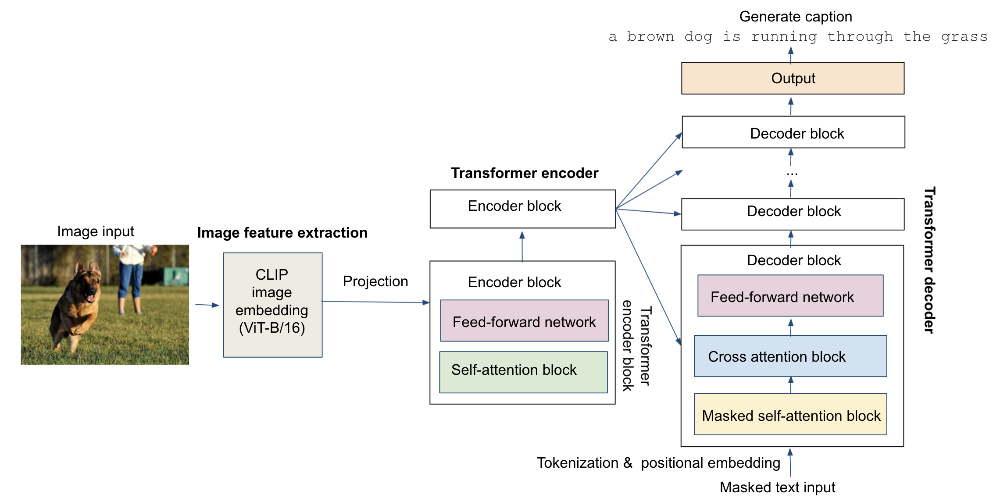

AC215-KKST
==============================

This is the repository for the final project of Harvard AC215 - Advanced Pratcial Data Science (DevOps for Deep Learning), Fall 2021. 

### Team Members
- Matthew Stewart 
- Steve Knapp 
- Al-Muataz Khalil 
- Shih-Yi Tseng 
- Ed Bayes

# Topic: Image Captioning

In this project, we trained a deep learning model for image captioning, and built a web-based AI App that allows users to upload images in the frontend and generate captions with the model. 

## Model description

Our image captioning model is a transformer-based model. It consists of an encoder part based on extracted features of an input image, and a decoder part that generates caption. 

For image feature extraction, we use the ViT-B/16 image encoder of the OpenAI CLIP model as the feature extractor, which outputs a 512-dim embedding for an input image. The CLIP model was pre-trained to minimize contrastive loss between a large dataset with matching images and captions, which learns a latent embedding that represents details of an image and its corresponding langauge descritpion.
- Read about CLIP: https://openai.com/blog/clip/
- Github for CLIP: https://github.com/openai/CLIP

For the transformer, we implemented 2 extra encoder blocks (since the CLIP embedding is already an output of a visual transformer, ViT-B/16), together with 6 decoder blocks to generate captions. The embedded dimension for both image feature and tokenized text is 512, and each attention block in the encoder/decoder has 10 attention heads. The model was trained on the [Flickr8k](https://www.kaggle.com/adityajn105/flickr8k) and [MS-COCO](https://cocodataset.org/#home) datasets with ~600k image-caption pairs. 

For details of the model, please refer to this [Colab notebook](https://github.com/skgithub14/AC215_KKST/blob/main/notebooks/Transformer_based_image_captioning_with_CLIP_embedding.ipynb) in the notebook folder.

## Key components

The three key components of the App are

- **api-service**: contains codes for the models and API server
- **frontend-react**: contains codes for the React frontend
- **deployment**: contains scripts for deploying the App on Google Cloud Platform (GCP)

## Setup
### API

### Frontend

### Deployment

Project Organization
------------
      .
      ├── LICENSE
      ├── Makefile
      ├── README.md
      ├── api-service
      ├── frontend-react
      ├── deployment
      ├── api-baseline
      ├── frontend-simple
      ├── data
      ├── models
      ├── notebooks
      ├── references
      ├── requirements.txt
      ├── setup.py
      ├── src
      │   ├── __init__.py
      │   └── build_features.py
      ├── submissions
      │   ├── milestone1_KKST
      │   ├── milestone2_KKST
      │   ├── milestone3_KKST
      │   └── milestone4_KKST
      └── test_project.py

--------

<small>Project based on the <a target="_blank" href="https://drivendata.github.io/cookiecutter-data-science/">cookiecutter data science project template</a>. #cookiecutterdatascience</small>

