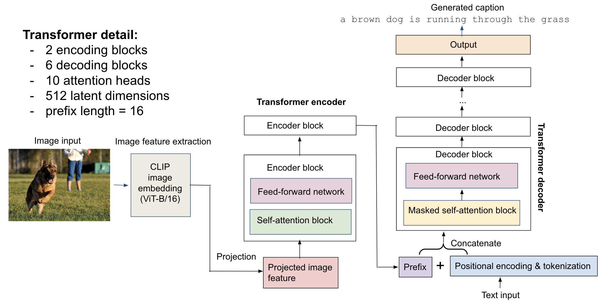

AC215-KKST
==============================

This is the repository for the final project of Harvard AC215 - Advanced Practical Data Science (DevOps for Deep Learning), Fall 2021. 

### Team Members
- Steve Knapp 
- Shih-Yi Tseng 
- Al-Muataz Khalil
- Matthew Stewart  
- Ed Bayes

# Topic: Image Captioning

In this project, we trained a deep learning model for image captioning, and built a web-based AI App that allows users to upload images in the frontend and generate captions with the model. 

## Model description

Our first image captioning model is a transformer-based, standard encoder-decoder model. It consists of an encoder part based on extracted features of an input image, and a decoder part that generates caption. 

Schematic of the **encoder-decoder model**:


Our second model is a prefix model, which appends the encoded image feature to the embedded text as a prefix, and uses the decoder to generate caption (no cross-attention blocks for the decoder).

Schematic of the **prefix model**:



For image feature extraction, we use the ViT-B/16 image encoder of the OpenAI CLIP model as the feature extractor, which outputs a 512-dim embedding for an input image. The CLIP model was pre-trained to minimize contrastive loss between a large dataset with matching images and captions, which learns a latent embedding that represents details of an image and its corresponding langauge descritpion.
- Read about CLIP: https://openai.com/blog/clip/
- Github for CLIP: https://github.com/openai/CLIP

For the transformer, we implemented 2 extra encoder blocks (since the CLIP embedding is already an output of a visual transformer, ViT-B/16), together with 6 decoder blocks to generate captions. The embedded dimension for both image feature and tokenized text is 512, and each attention block in the encoder/decoder has 10 attention heads. The prefix / projected length of the image features is 16. Additionally, we trained a distilled model of the prefix model with smaller architecture (1 encoder block, 3 decoder blocks, 8 attention heads, prefix length 10). Both models were trained on the [Flickr8k](https://www.kaggle.com/adityajn105/flickr8k) and [MS-COCO](https://cocodataset.org/#home) datasets with ~600k image-caption pairs. 

Some example captions generated on images in our test data from Flickr8k and MS-COCO datasets.


For details of the models, please refer to this [Colab notebook](https://github.com/skgithub14/AC215_KKST/blob/main/notebooks/Transformer_based_image_captioning_with_CLIP_embedding.ipynb) for encoder-decoder model and this [Colab notebook](https://github.com/skgithub14/AC215_KKST/blob/main/notebooks/CLIP_Prefix_Transformer_Image_Captioning_with_Distillation.ipynb) for prefix model with distillation in the **notebooks** folder.

The [code](https://github.com/skgithub14/AC215_KKST/blob/main/api-service/api/model.py) can also be found in **api-service/api** folder.


## App Design


API
We built an API server to serve these models using FastAPI. Upon startup, the API server downloads the saved model weights from a GCP bucket, and when receiving an input image, it returns the generated caption for that image. 

Frontend
We used React.js to build the frontend of the Image Captioning App. The frontend allows users to upload an image and select a model type for captioning, and makes requests to the API. It then displays the caption generated by the selected model.

Deployment
The App is then deployed onto Kubernetes Clusters on Google Cloud Platform. We stored the Docker images for both the API server and React frontend to Google Container Registry, and then created virtual machines that run these containers on the cluster with Kubernetes.


## Key components

The three key components of the App are

- **api-service**: contains codes for the models and API server
- **frontend-react**: contains codes for the React frontend
- **deployment**: contains scripts for deploying the App on Google Cloud Platform (GCP)

## Setup
### API

The **api-service** folder holds the files to set up the Docker container and pipenv virtual environment, as well as Python codes (inside `api` subfolder) for running the API server to serve our image captioning model.

Before running, add the [GCP bucket authorization file](https://github.com/skgithub14/AC215_KKST/blob/main/secrets/bucket-reader.json) into the `secrets` folder in the parent directory, and name the file as `bucket-reader.json`.

Change directory back to this folder, run `sh docker-shell.sh` or `docker-shell.bat` to build and start the container, and then run `uvicorn_server` to start the API server at http://localhost:9000.

Upon startup, it executes the function in `api/download_model.py` to scrape tokenizer and model weights from the GCP bucket into the **persistent-folder** in the parent directory. 

The `/predict` service uses the encoder-decoder transformer model (defined in `api/model.py`) to generate caption of an image, the `/predict_prefix` service uses the prefix transformer model,the `/predict_distill` service uses the prefix transformer model, and the `/predict_rnn` service uses the RNN model.

Upon interaction with the front-end, the server takes an upladed image as input and return a dictionary with the generated caption in the form of {'caption': generated_caption}.


### Frontend
The **frontend-react** folder holds the container for the react frontend app which creates a page that allows us to upload an image and view the predicted image caption.

To set up the react frontend, follow these steps:
- Run `sh docker-shell.sh` or `docker-shell.bat`
- Wait for docker shell to start up
- Run `yarn install`. This will ensure all your node packages for React are installed
- Run `yarn start` to start your React App
- Go to the page http://localhost:3000
- Upload image to get predicted caption

### Deployment
The **deployment** folder contains the files to build the Docker container and Ansible scripts for deploying our Image Captioning App to web with Kubernetes on Googld Cloud Platform (GCP).

#### 1. APIs required on GCP
- Compute Engine API
- Service Usage API
- Cloud Resource Manager API
- Google Container Registry API

#### 2. GCP service accounts
For deployment, we need to set up two GCP service accounts.

(1) `deployment` service account with required roles:
- Compute Admin
- Compute OS Login
- Container Registry Service Agent
- Kubernetes Engine Admin
- Service Account User
- Storage Admin

Once the account is created, make a json key named `deployment.json` and add it the the **secrets** folder.

(2) `gcp-service` service account with one required role:
- Storage Object Viewer

Once the account is created, make a json key named `gcp-service.json` and add it the the **secrets** folder.

Note that besides these two keys, make sure to put the `bucket-reader.json` [file](https://github.com/skgithub14/AC215_KKST/blob/main/secrets/bucket-reader.json) in the **secrets** folder too.

#### 3. Set up Docker container for deployment
Within this folder, run `sh docker-shell.sh` or `docker-shell.bat` in the terminal to build and enter the docker container.

Once inside the container, check the versions of these tools:
```
gcloud --version
ansible --version
kubectl version --client
```

Next, run `gcloud auth list` to check the authentication to GCP.

#### 4. Set up SSH key
First, configure OS Login for the service account:
```
gcloud compute project-info add-metadata --project <YOUR GCP_PROJECT> --metadata enable-oslogin=TRUE
```

Next, create SSH key for the service account in the **secrets** folder:
```
cd /secrets
ssh-keygen -f ssh-key-deployment
cd /app
```

Then, provide the public key to the gcloud compute instances:
```
gcloud compute os-login ssh-keys add --key-file=/secrets/ssh-key-deployment.pub
```

Copy the `username` of the output, which will be used in the next step.


#### 5. Deployment in a GCP Compute Instance (VM)
Before deployment, go to the `inventory.yml` file, change the ansible user to the username copied from last step, and change the service account email and project name to your own.

First, build and push the Docker images for the api-service and frontend to Google Container Registry:
```
ansible-playbook deploy-docker-images.yml -i inventory.yml
```

Next, create a VM instance in GCP:
```
ansible-playbook deploy-create-instance.yml -i inventory.yml --extra-vars cluster_state=present
```
Once the VM is created, get the IP address of the compute instance from GCP Console and update the appserver>hosts in the `inventory.yml` file.


Provision:
```
ansible-playbook deploy-provision-instance.yml -i inventory.yml
```

Setup Docker containers in the Compute Instance:
```
ansible-playbook deploy-setup-containers.yml -i inventory.yml
```

Setup webserver in the Compute Instance:
```
ansible-playbook deploy-setup-webserver.yml -i inventory.yml
```

Last, go to `http://<External IP>/` to see the Image Captioning App.

To delete the instnace, run
```
ansible-playbook deploy-create-instance.yml -i inventory.yml --extra-vars cluster_state=absent
```

#### 6. Deployment in a GCP Kubernetes Cluster

Before deploying on K8s cluster, make sure the Docker images for the api-service and frontend have been pushed to Google Container Registry.

Within the deployment container, run `gcloud auth list` to check GCP authentification. 

To deploy, run
```
ansible-playbook deploy-k8s-cluster.yml -i inventory.yml --extra-vars cluster_state=present
```

To view the App, copy the `nginx_ingress_ip` from the terminal after executing the create clsuter command, and then go to `http://<YOUR INGRESS IP>.sslip.io` to see the deployed App.


To delete the cluster, run
```
ansible-playbook deploy-k8s-cluster.yml -i inventory.yml --extra-vars cluster_state=absent
```


# Project Organization
------------
      .
      ├── LICENSE
      ├── Makefile
      ├── README.md
      ├── api-service
      ├── frontend-react
      ├── deployment
      ├── api-baseline
      ├── frontend-simple
      ├── data
      ├── models
      ├── notebooks
      ├── references
      ├── requirements.txt
      ├── setup.py
      ├── src
      │   ├── __init__.py
      │   └── build_features.py
      ├── submissions
      │   ├── milestone1_KKST
      │   ├── milestone2_KKST
      │   ├── milestone3_KKST
      │   └── milestone4_KKST
      └── test_project.py

--------

<p><small>Project based on the <a target="_blank" href="https://drivendata.github.io/cookiecutter-data-science/">cookiecutter data science project template</a>. #cookiecutterdatascience</small></p>
